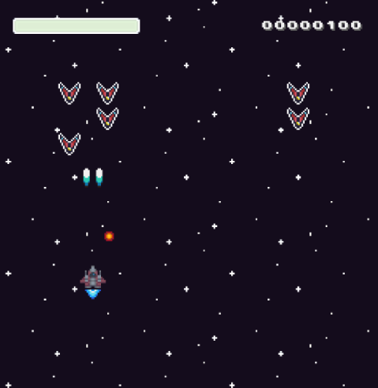

# Godot 101: Classic Shmup

Prototipo de shoot ’em up que implementa un tema basado en la plantilla de velocidad perceptiva de GameSense Developer Tools, diseñado para analizar y mejorar la jugabilidad.

El nombre del prototipo lo he llamado personalmente **ORVEX**. Sois completamente libres de dejar comentarios críticos en la página del [prototipo](https://josele-dev.itch.io/orvex) y podéis hacer Pull Requests si consideráis alguna mejora.

[Este *fork* se deriva del repositorio original](https://github.com/godotrecipes/classic_shmup).

[Para acceder a los recursos originales, podéis consultar la página](https://grafxkid.itch.io/mini-pixel-pack-3).

 
